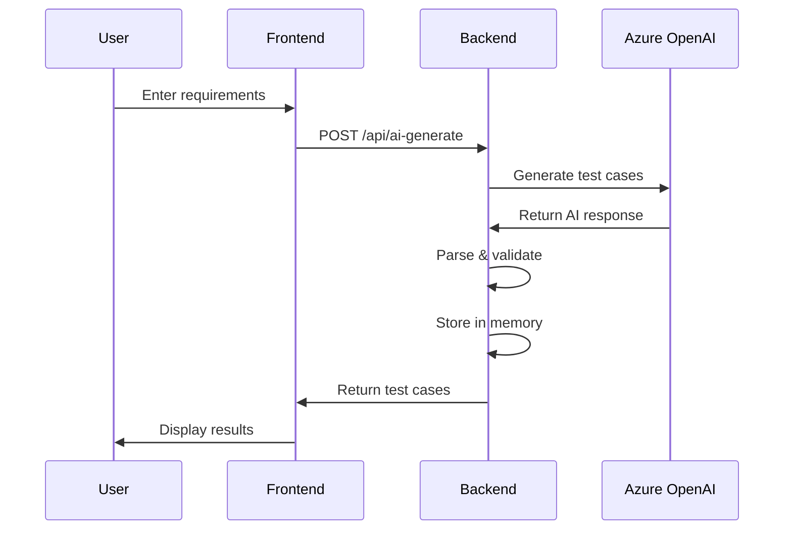
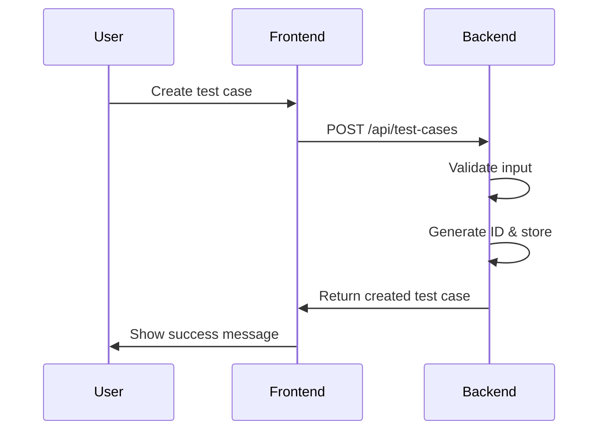

# TestGenie Enterprise - Complete API Reference

## 🌐 Base URL
```
http://localhost:5000
```

## 📋 Complete API Endpoints

### **🏠 Frontend Pages (Web Routes)**

| Route | Method | Purpose | Template |
|-------|--------|---------|----------|
| `/` | GET | Main dashboard | `dashboard.html` |
| `/projects` | GET | Project management page | `projects.html` |
| `/projects/<project_id>` | GET | Project detail view | `project_detail.html` |
| `/test-cases` | GET | Test case management | `test_cases.html` |
| `/test-case/<test_case_id>` | GET | Test case detail view | `test_case_detail.html` |
| `/test-runs` | GET | Test execution management | `test_runs.html` |
| `/ai-generator` | GET | AI test generation page | `ai_generator.html` |
| `/settings` | GET | Platform settings | `settings.html` |
| `/reports` | GET | Analytics and reports | `reports.html` |

### **🔧 System & Health APIs**

#### **Health Check**
```http
GET /api/health
```
**Response:**
```json
{
    "status": "healthy",
    "timestamp": "2025-08-08T10:30:00Z",
    "version": "1.0.0"
}
```

#### **Dashboard Statistics**
```http
GET /api/dashboard-stats
```
**Response:**
```json
{
    "total_projects": 5,
    "total_test_cases": 156,
    "total_test_suites": 23,
    "active_test_runs": 3,
    "recent_activity": [...],
    "test_case_stats": {
        "by_status": {...},
        "by_priority": {...}
    }
}
```

### **📁 Project Management APIs**

#### **List Projects**
```http
GET /api/projects
```
**Response:**
```json
[
    {
        "id": "proj_001",
        "name": "Web Application Testing",
        "description": "E-commerce website testing project",
        "created_by": "admin",
        "created_at": "2025-08-01T10:00:00Z"
    }
]
```

#### **Create Project**
```http
POST /api/projects
Content-Type: application/json

{
    "name": "Mobile App Testing",
    "description": "iOS and Android app testing"
}
```
**Response:**
```json
{
    "id": "proj_002",
    "name": "Mobile App Testing",
    "description": "iOS and Android app testing",
    "created_by": "admin",
    "created_at": "2025-08-08T10:30:00Z"
}
```

### **📝 Test Case Management APIs**

#### **List Test Cases (with Filtering)**
```http
GET /api/test-cases?project_id=proj_001&status=Draft&priority=High
```
**Query Parameters:**
- `project_id`: Filter by project
- `status`: Draft, Under Review, Approved, etc.
- `priority`: Low, Medium, High
- `search`: Search in title/description

**Response:**
```json
[
    {
        "id": "tc_001",
        "title": "User Login Functionality",
        "description": "Test user authentication flow",
        "steps": [
            "Navigate to login page",
            "Enter valid credentials",
            "Click login button"
        ],
        "expected_result": "User should be logged in successfully",
        "priority": "High",
        "status": "Draft",
        "project_id": "proj_001",
        "created_by": "admin",
        "created_at": "2025-08-08T10:00:00Z",
        "tags": ["authentication", "ui"]
    }
]
```

#### **Create Test Case**
```http
POST /api/test-cases
Content-Type: application/json

{
    "title": "Password Reset Flow",
    "description": "Test password reset functionality",
    "steps": [
        "Click 'Forgot Password' link",
        "Enter email address",
        "Check email for reset link"
    ],
    "expected_result": "Password reset email sent successfully",
    "priority": "Medium",
    "project_id": "proj_001",
    "tags": ["authentication", "email"]
}
```

#### **Get/Update/Delete Test Case**
```http
GET /api/test-cases/<test_case_id>
PUT /api/test-cases/<test_case_id>
DELETE /api/test-cases/<test_case_id>
```

### **🤖 AI Integration APIs**

#### **Generate Test Cases with AI**
```http
POST /api/ai-generate
Content-Type: application/json

{
    "requirements": "User authentication system with login, logout, and password reset",
    "project_id": "proj_001",
    "test_type": "functional",
    "count": 5
}
```

**Response:**
```json
{
    "generated_cases": [
        {
            "id": "tc_ai_001",
            "title": "Valid User Login",
            "description": "Test successful login with valid credentials",
            "steps": [...],
            "expected_result": "User logged in successfully",
            "priority": "High",
            "tags": ["ai-generated", "authentication"]
        }
    ],
    "count": 5,
    "generated_at": "2025-08-08T10:30:00Z",
    "status": "success",
    "ai_provider": "azure",
    "provider_details": {
        "model": "gpt-4",
        "deployment": "gpt-4-deployment"
    }
}
```

#### **Generate Postman-Ready API Tests**
```http
POST /api/ai-generate-postman
Content-Type: application/json

{
    "requirements": "REST API for user management with CRUD operations",
    "project_id": "proj_001",
    "test_type": "api",
    "count": 3
}
```

**Response:**
```json
{
    "generated_cases": [...],
    "postman_collection": {
        "info": {
            "name": "User Management API Tests",
            "description": "Generated API test collection"
        },
        "item": [
            {
                "name": "Create User",
                "request": {
                    "method": "POST",
                    "url": {
                        "raw": "{{base_url}}/api/users",
                        "host": ["{{base_url}}"],
                        "path": ["api", "users"]
                    },
                    "body": {
                        "mode": "raw",
                        "raw": "{\n  \"name\": \"John Doe\",\n  \"email\": \"john@example.com\"\n}"
                    }
                },
                "event": [
                    {
                        "listen": "test",
                        "script": {
                            "exec": [
                                "pm.test('Status code is 201', function () {",
                                "    pm.response.to.have.status(201);",
                                "});"
                            ]
                        }
                    }
                ]
            }
        ]
    },
    "format": "postman_ready"
}
```

#### **AI Provider Status**
```http
GET /api/ai-status
```

**Response:**
```json
{
    "ai_providers": {
        "primary_provider": "azure",
        "available_providers": ["azure", "openai"],
        "provider_details": {
            "azure": {
                "status": "active",
                "model": "gpt-4",
                "deployment": "gpt-4-deployment",
                "endpoint": "https://your-resource.openai.azure.com/"
            }
        }
    },
    "capabilities": [
        "test_case_generation",
        "postman_collections",
        "multiple_test_types"
    ]
}
```

### **🏃 Test Execution APIs**

#### **List Test Runs**
```http
GET /api/test-runs?status=In Progress
```

#### **Create Test Run**
```http
POST /api/test-runs
Content-Type: application/json

{
    "name": "Sprint 3 Regression Tests",
    "test_suite_id": "ts_001",
    "auto_start": false
}
```

#### **Start Test Run**
```http
POST /api/test-runs/<test_run_id>/start
```

#### **Complete Test Run**
```http
POST /api/test-runs/<test_run_id>/complete
Content-Type: application/json

{
    "results": {
        "tc_001": "Passed",
        "tc_002": "Failed",
        "tc_003": "Passed"
    }
}
```

## 🔄 Data Flow Examples

### **AI Test Generation Flow**


### **Test Case CRUD Flow**


## 🎯 Request/Response Patterns

### **Standard Success Response**
```json
{
    "status": "success",
    "data": {...},
    "message": "Operation completed successfully",
    "timestamp": "2025-08-08T10:30:00Z"
}
```

### **Standard Error Response**
```json
{
    "error": "Validation failed",
    "details": {
        "field": "title",
        "message": "Title is required"
    },
    "status_code": 400,
    "timestamp": "2025-08-08T10:30:00Z"
}
```

## 📊 Performance Characteristics

| Endpoint | Avg Response Time | Notes |
|----------|-------------------|-------|
| GET /api/health | < 50ms | Simple health check |
| GET /api/projects | < 100ms | In-memory lookup |
| POST /api/test-cases | < 200ms | Validation + storage |
| POST /api/ai-generate | 5-15s | AI processing time |
| GET /api/dashboard-stats | < 300ms | Aggregation calculations |

## 🔐 Security & Validation

### **Input Validation Rules**
- **Project names**: 3-100 characters, alphanumeric + spaces
- **Test case titles**: 5-200 characters, required
- **AI generation count**: 1-20 (cost protection)
- **File uploads**: .pdf, .doc, .docx, .txt, .md, .json, .xml only

### **Error Handling**
- All endpoints wrapped in try-catch blocks
- Structured error responses with proper HTTP status codes
- Logging for debugging and monitoring
- Graceful degradation for AI service failures

This comprehensive API reference covers all 19 routes and their complete functionality in the TestGenie Enterprise platform!
